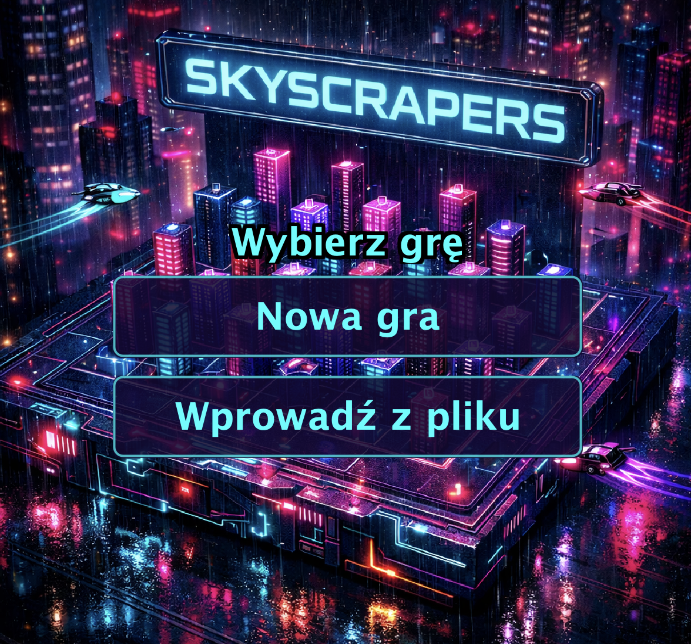
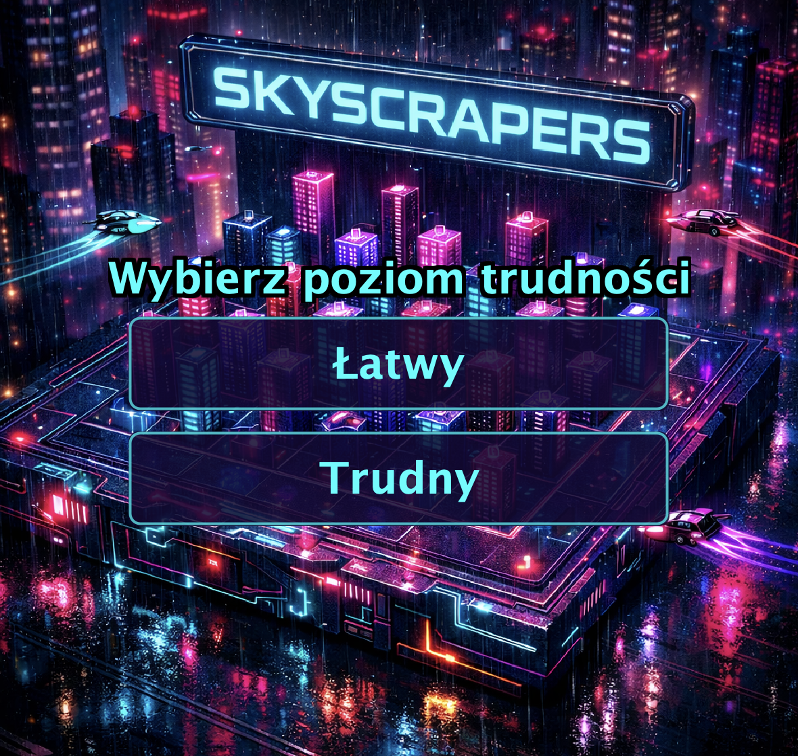
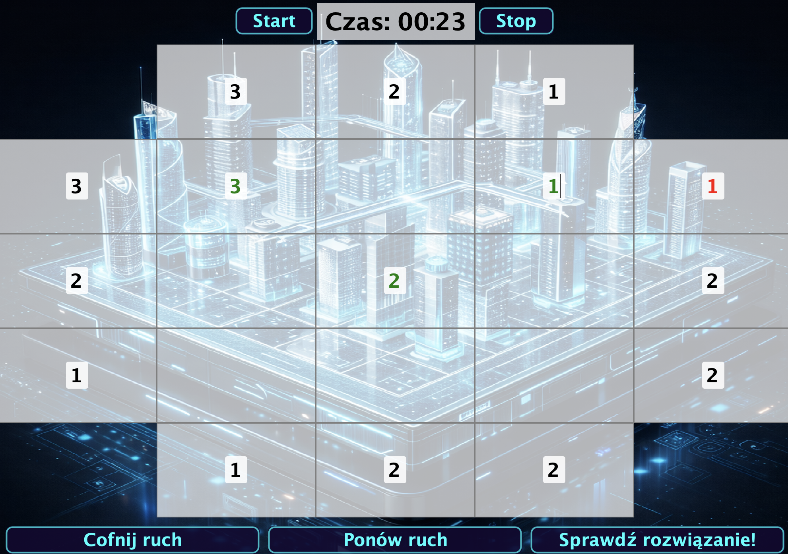

# 🏙️ Skyscrapers — gra logiczna z GUI

Gra logiczna **Skyscrapers** zaimplementowana w Javie z graficznym interfejsem użytkownika (Swing).  
Celem gry jest wypełnienie planszy liczbami tak, aby spełnione były wskazówki widoczności budynków z każdej strony.

---

## 📸 Zrzuty ekranu

### Ekran główny (lobby)

<p align="center">
  
</p>

### Wybór poziomu trudności

<p align="center">
  
</p>

### Rozgrywka (plansza 3×3)

<p align="center">
  
</p>

---

## ✨ Funkcjonalności

| Funkcja                | Opis                                                          |
| ---------------------- | ------------------------------------------------------------- |
| 🎮 **Nowa gra**        | Generowanie losowych plansz o rozmiarach 3×3 – 7×7            |
| 📂 **Wczytaj z pliku** | Import planszy z pliku tekstowego                             |
| 💾 **Zapis gry**       | Eksport aktualnego stanu gry do pliku                         |
| ⏱️ **Timer**           | Pomiar czasu rozwiązywania łamigłówki                         |
| ↩️ **Undo / Redo**     | Cofanie i ponawianie ruchów                                   |
| ✅ **Walidacja**       | Kolorowe podświetlanie błędnych pól w czasie rzeczywistym     |
| 🧩 **Solver**          | Algorytm backtrackingu do automatycznego rozwiązywania plansz |
| 🎨 **Neonowy design**  | Ciemny, cyberpunkowy interfejs z dynamicznym tłem             |

---

## 🚀 Uruchomienie

### Wymagania

- **Java JDK 17+** (lub nowszy)

### Kompilacja i uruchomienie

```bash
# Sklonuj repozytorium
git clone <URL_REPOZYTORIUM>

# Wejdź do katalogu projektu
cd zpoif_2025_zespol_nr_9

# Skompiluj wszystkie pliki źródłowe
javac -d out src/*.java

# Uruchom grę
java -cp out Game
```

### Uruchomienie z IDE

1. Otwórz projekt w **IntelliJ IDEA** lub **Eclipse**
2. Ustaw `src/` jako katalog źródłowy
3. Uruchom klasę `Game.java` (zawiera `main()`)

---

## 📁 Struktura projektu

```
├── src/                          # Kod źródłowy
│   ├── Game.java                 # Punkt wejścia (main)
│   ├── SkyscrapersGameGUI.java   # GUI — interfejs graficzny (Swing)
│   ├── Board.java                # Reprezentacja planszy
│   ├── Solver.java               # Algorytm backtrackingu (solver)
│   ├── Generator.java            # Generator losowych plansz
│   ├── GameState.java            # Stan gry (do undo/redo)
│   ├── Difficulty.java           # Enum poziomów trudności
│   ├── BackgroundPanel.java      # Panel z obrazem tła
│   └── IncorrectBoardSizeException.java
├── resources/                    # Zasoby graficzne
│   ├── towers.jpeg               # Tło gry
│   ├── icon.jpg                  # Ikona okna
│   └── ...                       # Pozostałe grafiki
├── test/                         # Testy jednostkowe
├── screenshots/                  # Zrzuty ekranu
├── Skyscrapers_dokumentacja.pdf  # Dokumentacja projektu
└── Skyscrapers_prezentacja.pdf   # Prezentacja projektu
```

---

## 🧠 Algorytm

Gra wykorzystuje **algorytm backtrackingu** (przeszukiwanie z nawrotami) do:

- **Rozwiązywania** plansz — rekurencyjne próbowanie wartości z walidacją wskazówek
- **Generowania** nowych plansz — tworzenie poprawnego rozwiązania, a następnie usuwanie pól

---

## 🛠️ Technologie

- **Java 17+**
- **Swing** — GUI
- **JUnit** — testy jednostkowe

---

## � Autor

**Bartłomiej Domanowski** — Politechnika Warszawska, styczeń 2025.
