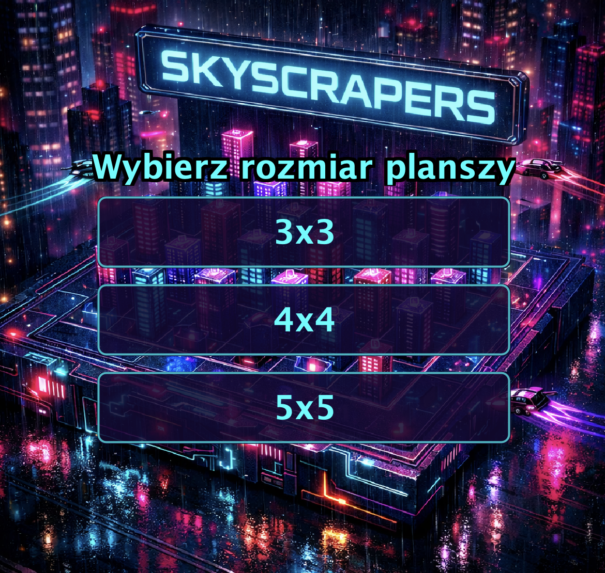

# Skyscrapers — gra logiczna z GUI

Gra logiczna **Skyscrapers** zaimplementowana w Javie z graficznym interfejsem użytkownika (Swing).  
Celem gry jest wypełnienie planszy liczbami tak, aby spełnione były wskazówki widoczności budynków z każdej strony.

---

## Zrzuty ekranu

### Ekran główny (lobby)

<p align="center">
  
</p>

### Wybor rozmiaru planszy

<p align="center">
  
</p>

### Wybór poziomu trudności

<p align="center">
  
</p>

### Rozgrywka (plansza 3x3)

<p align="center">
  
</p>

---

## Funkcjonalnosci

| Funkcja             | Opis                                                          |
| ------------------- | ------------------------------------------------------------- |
| **Nowa gra**        | Generowanie losowych plansz o rozmiarach 3x3 - 7x7            |
| **Wczytaj z pliku** | Import planszy z pliku tekstowego                             |
| **Zapis gry**       | Eksport aktualnego stanu gry do pliku                         |
| **Timer**           | Pomiar czasu rozwiazywania lamiglowki                         |
| **Undo / Redo**     | Cofanie i ponawianie ruchow                                   |
| **Walidacja**       | Kolorowe podswietlanie blednych pol w czasie rzeczywistym     |
| **Solver**          | Algorytm backtrackingu do automatycznego rozwiazywania plansz |
| **Neonowy design**  | Ciemny, cyberpunkowy interfejs z dynamicznym tlem             |

---

## Uruchomienie

### Wymagania

- **Java JDK 17+** (lub nowszy)

### Kompilacja i uruchomienie

```bash
# Sklonuj repozytorium
git clone https://github.com/BartekDomanowski/skyscrapers_game.git

# Wejdz do katalogu projektu
cd skyscrapers_game

# Skompiluj wszystkie pliki zrodlowe
javac -d out src/*.java

# Uruchom gre
java -cp out Game
```

### Uruchomienie z IDE

1. Otworz projekt w **IntelliJ IDEA** lub **Eclipse**
2. Ustaw `src/` jako katalog zrodlowy
3. Uruchom klase `Game.java` (zawiera `main()`)

---

## Struktura projektu

```
├── src/                          # Kod zrodlowy
│   ├── Game.java                 # Punkt wejscia (main)
│   ├── SkyscrapersGameGUI.java   # GUI — interfejs graficzny (Swing)
│   ├── Board.java                # Reprezentacja planszy
│   ├── Solver.java               # Algorytm backtrackingu (solver)
│   ├── Generator.java            # Generator losowych plansz
│   ├── GameState.java            # Stan gry (do undo/redo)
│   ├── Difficulty.java           # Enum poziomow trudnosci
│   ├── BackgroundPanel.java      # Panel z obrazem tla
│   └── IncorrectBoardSizeException.java
├── resources/                    # Zasoby graficzne
│   ├── towers.jpeg               # Tlo gry
│   ├── icon.jpg                  # Ikona okna
│   └── ...                       # Pozostale grafiki
├── test/                         # Testy jednostkowe
├── screenshots/                  # Zrzuty ekranu
├── Skyscrapers_dokumentacja.pdf  # Dokumentacja projektu
└── Skyscrapers_prezentacja.pdf   # Prezentacja projektu
```

---

## Algorytm

Gra wykorzystuje **algorytm backtrackingu** (przeszukiwanie z nawrotami) do:

- **Rozwiazywania** plansz — rekurencyjne probowanie wartosci z walidacja wskazowek
- **Generowania** nowych plansz — tworzenie poprawnego rozwiazania, a nastepnie usuwanie pol

---

## Technologie

- **Java 17+**
- **Swing** — GUI
- **JUnit** — testy jednostkowe

---

## Autor

**Bartlomiej Domanowski** — Politechnika Warszawska, styczen 2025.
